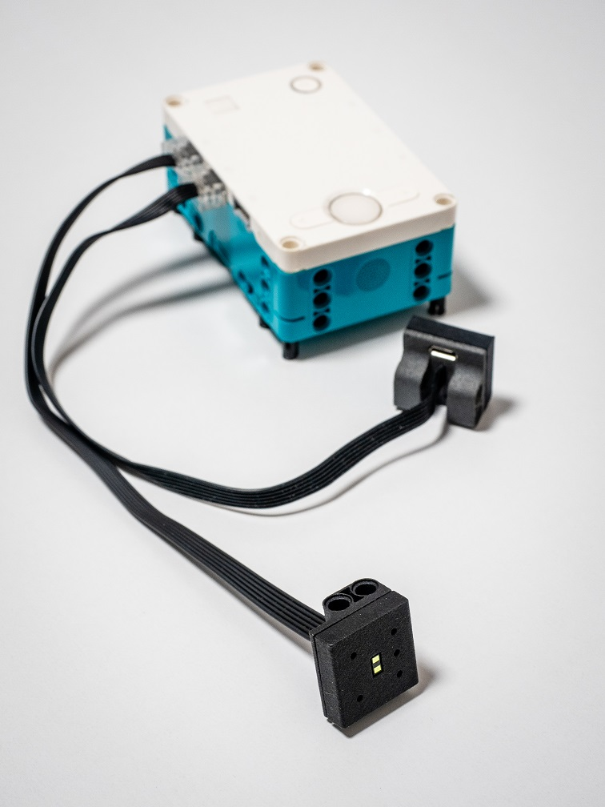
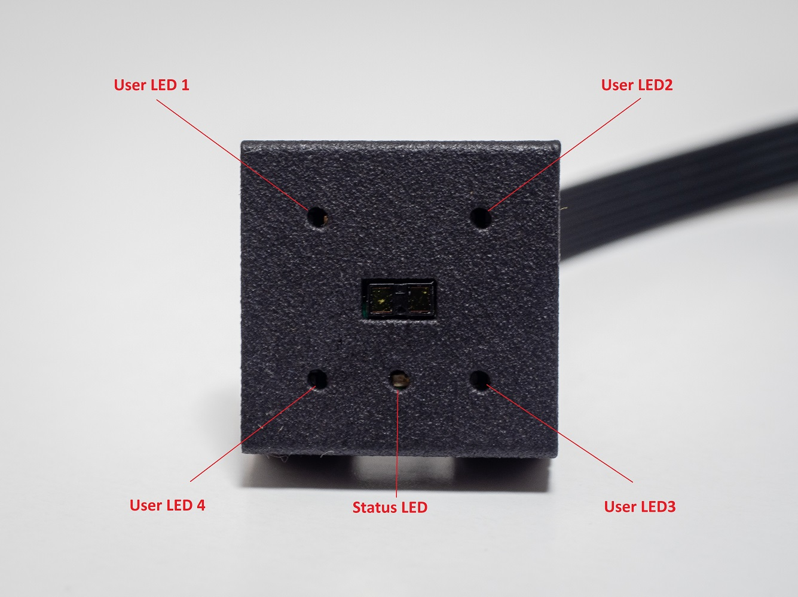
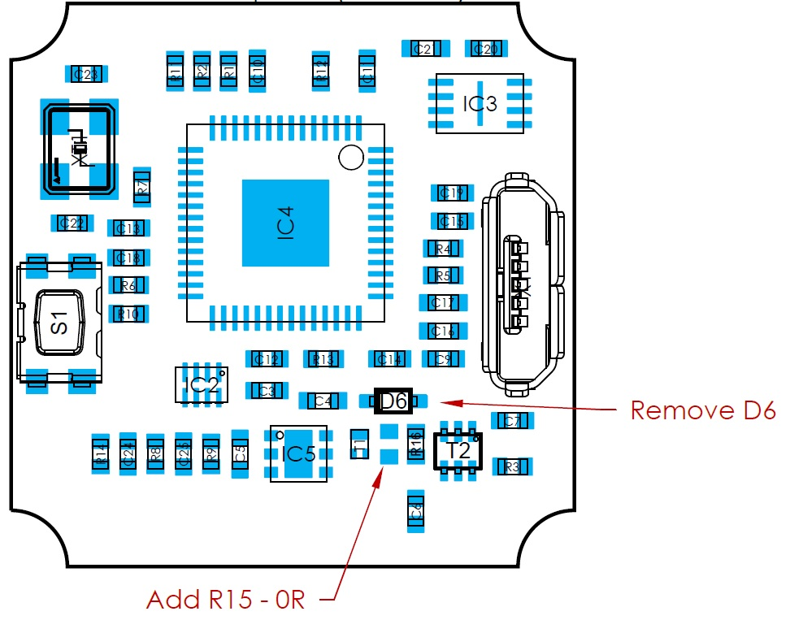

# LEGO® laser distance sensor
LEGO® laser distance sensor is open-source, which is used for robust distance measuring in educational robotic applications with LEGO® Mindstorms kits.
Advantages over the original LEGO® ultrasonic sensor:

 - Extended measurement range of up to 400 cm
 - Lower susceptibility to interference from other sensors
 - The refresh rate of up to 50 Hz
 - Based on [VL53L1x](https://www.st.com/en/imaging-and-photonics-solutions/vl53l1x.html) and [RP2040](https://www.raspberrypi.com/products/rp2040/)



## LEGO® Mindstorms
The laser sensor is recognized in the LEGO® Mindstorms app as an original ultrasonic sensor. You can therefore use standard blocks for distance measurement.



#### Connection signalization
When connecting the laser sensor to LEGO® Spike/EV3, the status LED will flash. Once the laser sensor and LEGO® Spike/EV3 are correctly connected, the status LED will remain on.

#### Known issues
The laser sensor does not currently support additional LED illumination, making it incompatible with the ultrasonic sensor as a direct replacement.

## Hardware
The hardware is designed to operate with a power supply of either 3.3V or 5V, utilizing a low-drop LDO. The sensor can be used with LEGO® Spike (3.3V) or LEGO® EV3 (5V). For use with LEGO® EV3, an adapter is required to connect the sensor to the EV3 RJ12 connector. Alternatively, the laser distance sensor can be connected via a micro USB connector for programming custom applications in MicroPython or for use with a custom robotic application, such as Raspberry Pi.

### Issues - not tested
<span style="color:red">
The power supply control logic, which switches between the micro USB connector and the LEGO® Powered Up connector, has not been tested yet. We recommend unsoldering diode D6 and soldering resistor R15 (0R) to use the power supply solely from the LEGO® Powered Up connector.
</span>



### LEGO® Powered Up connector
https://www.aliexpress.com/item/1005004076370021.html?spm=a2g0o.order_list.order_list_main.98.2dce1802ppkqRz

## CAD models
The CAD folder contains files of the sensor case. It was designed for MJF 3D printer and it is recommended to use this type of printer.

## Software
### Requirements

- Python 3
- pip3
- rshell

#### Installing rshell
Linux:

```
pip3 install rshell
```

Windows:

```
python.exe -m pip install --upgrade pip
```

## How to bring the sensor up

### Flashing MicroPython Firmware
1. Press and hold the BOOTSEL button and plug your Lego Distance Sensor into the USB port of your computer. Release the BOOTSEL button after your Lego Distance Sensor is connected.
2. It will be detected as a Mass Storage Device called RPI-RP2.
3. Drag and drop the MicroPython UF2 file onto the RPI-RP2 storage.
4. Your Lego Distance Sensor will reboot and should be rediscovered by your system. If yes, you are now running MicroPython otherwise repeat step 1.
5. You can access micropython console using the REPL via USB Serial.

### Uploading Sensor Application Files
1. Connect to the Lego Distance Sensor's serial port from the command line.

   Linux:

   ```
   rshell -p /dev/ttyXXX --buffer-size 512
   ```

   Windows:

   ```
   rshell -p comXXX --buffer-size 512
   ```

2. Upload \*.py files

    ```
    cp main.py VL53L1X.py /pyboard
    ```

3. Verify that the \*.py files were successfully written.

    ```
    ls /pyboard
    ```

Alternatively, you can run a single command to perform these steps:

- Linux:

  ```
  rshell -p /dev/ttyXXX --buffer-size 512 cp main.py VL53L1X.py LPF2.py /pyboard
  ```

- Windows:

  ```
  rshell -p comXXX --buffer-size 512 cp main.py VL53L1X.py LPF2.py /pyboard
  ```
